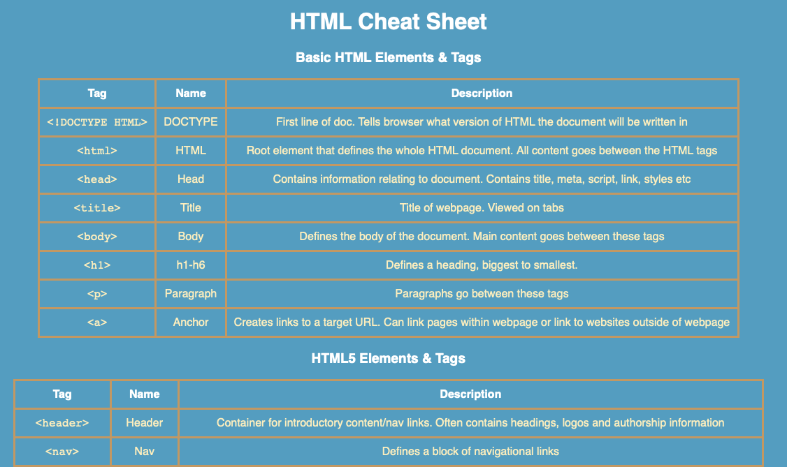

# HTML & CSS Cheat Sheet

## Goal
The goal of this project was to create an HTML cheat sheet that can be used as a reference when developing future webpages. As well as this, we had to implement basic CSS styling. 

## Languages & Tools Used
1. HTML
2. CSS
3. Git and Github